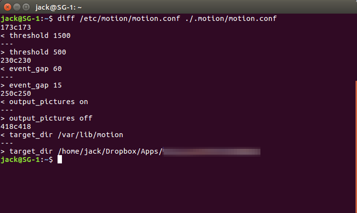

# CatCam

At [Make Tech Easier][damien], Damien shows how to set up a motion sensing
webcam on Linux, and suggests storing the files on Dropbox to view from
anywhere. Great idea!

This repo simply makes use of the Dropbox API to list the Dropbox files with
file sizes.


Why use the API and not just the Dropbox web site, you ask? Well, because
Dropbox doesn't list how big the files are (at least not in 2017), giving no
indication of which files have significant content ..not without clicking each
file's properties, which, umm.. no.

### Prereqs

- A Dropbox account
- A Linux box with a webcam (somewhere near your cats) :smile_cat: :smile_cat:
- A web site to publish these PHP files

### Set up

1. To use the Dropbox API, go to https://dropbox.com/developers/apps
   to create an app and get a token. To protect my other Dropbox data, I
   chose to use the kind of app that's restricted to a single folder.

1. After downloading or cloning this repo, follow the config template to create
   a `config/catcfg.inc` file with the Dropbox app name and token. For example:

   ```php
   $c = Array(
     'app' => 'myunique_dropbox_catcam',
     'tok' => '56YrsSSSSSSome-Long-64-Character-Token-For-Your-DropboxAPP_BBBgh',
   );
   ```

1. Setup and run `motion` to capture the videos. I have a cheap webcam on a Linux
   box that runs the motion application. When it senses motion (a field of a few
   hundred pixels has changed), it writes a movie file to the same folder that is
   owned by the Dropbox app. See [Damien's article][damien] for information on
   setting up the Motion application. The following diff shows the only changes
   I made to Motion's configuration file, based on where my camera was placed and
   the approximate size of a cat on the far wall on my home.

   

1. Upload this catcam folder to your web site.

   **Note:** If you're site doesn't run Apache or allow `.htaccess` file overrides,
   hide your `catcfg.inc` file some other way, such as moving it out of the web folder
   to another location on your server. Update the `include` statements in the PHP
   scripts accordingly.

1. Point your browser to the `/catcam/` folder on your web site and click away!

## Programming notes

So, when first run, the token is obtained and an API call made to `/list_folder`,
which returns an array of file entry records, with name, size, and other things.
I only care about the name and size. Those are listed.

The `/list_folder` call will also return a `has_more` value of `true` and
`cursor` value if there are more files than could be retrieved in this first
call. These values are used to retrieve subsequent pages of results. So, if
there are more pages, a button is shown with the cursor value below the list.
At the time of this writing, looks like the default number of items per page
is 2000. Could specify an item `limit` per page in the data passed to
`/list_folder`, but nah.

When the user clicks the button, this same page is loaded but with the cursor
as a POST parameter. That logic is at the top of the page, so that if a cursor
is passed to this page, it'll call the `/list_folder/continue` API (with the
cursor value) instead of the `/list_folder` one. Dropbox then retrieves the
subsequent page of results.

For more info, see the [Dropbox API doc on `/list_folder`][dropapi].

I discovered that you can't share a folder that is used by a _folder-restricted_
app. So, I added the download link to bypass the need to have account access to
get the video. The link POSTs path and size info to Drobox's `/download` endpoint.
I couldn't get PHP's `file_get_contents()` to work with the binary data stream,
so I ended up using curl in the `catget.php` file.

And that's about it.

[damien]: https://www.maketecheasier.com/setup-motion-detection-webcam-ubuntu/
[dropapi]: https://www.dropbox.com/developers/documentation/http/documentation#files-list_folder
